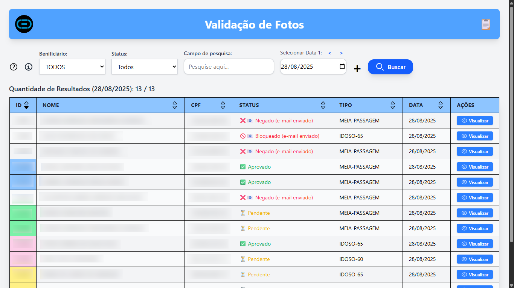
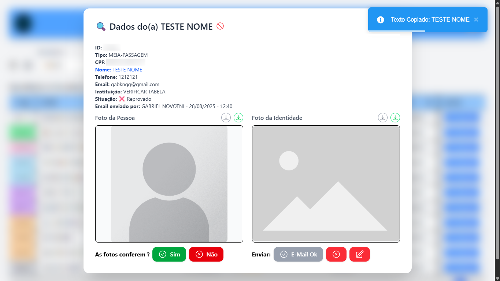
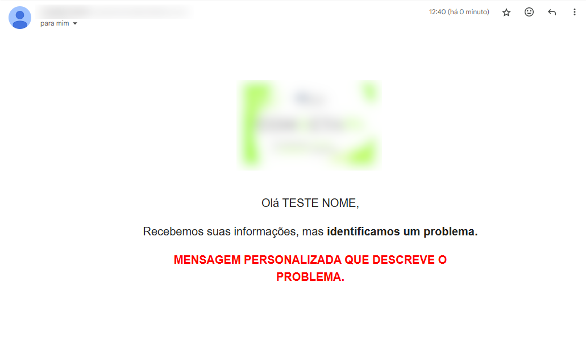

# Sistema de Validação de Cadastros — Migração de Bilhetagem

Solução desenvolvida para validar registros de usuários durante a troca do sistema de bilhetagem. Recebe dados e fotos via formulário, valida com regras de negócio e segurança, sincroniza registros aprovados com o sistema da nova operadora e envia notificações por e-mail (aprovado / erro).

Projeto executado em regime intensivo durante a janela de migração — prazos curtos, alta pressão operacional e necessidade de entrega segura e auditável. Resultado: solução mínima viável com foco em segurança, automação e comunicação clara com os usuários.

Além da validação de dados, o sistema oferece **ferramentas de filtragem, comunicação por e-mail e facilidades administrativas** que otimizam o trabalho dos responsáveis pelo cadastro.

---

## Recursos principais

- 🧾 **Interface administrativa** para validação com ações rápidas (copiar dados, baixar imagem comprimida, enviar e-mail ok/erro).  
- 🔍 **Filtros avançados** para facilitar a visualização e organização das respostas.  
- 📧 **Envio de e-mails** com template para aprovação e template com texto editável para erro/rejeição.  
- ✔️ **Log de auditoria** para cada ação (quem validou, quando).  
- 📊 **Organização de status** (pendente, aprovado, irregular, bloqueado, etc.).  
- 📁 **Integração com informações provenientes de .xlsx e do banco de dados**.

---

## Demonstração (imagens)

1) **Visão geral da tabela**  
Tabela com opções de filtragem e separação por cor (cor do fundo do campo `id`) para otimização do processo administrativo.  

2) **Visão detalhada do registro**  
Página do registro: copiar dados para área de transferência, baixar imagem comprimida, enviar e-mail ok/erro.  

3) **Exemplo de e-mail**  

---

## Autoria

- [Gabriel Novotni](https://github.com/Geros-Von-Valdo) — Front-end (interfaces administrativas, UX), integração de sistemas (APIs e sincronização) e funcionalidades de envio de e-mails.  
- [João Kinkoski](https://github.com/kinkoskisDev) — Back-end (APIs, ingestão e processamento de dados).

---
